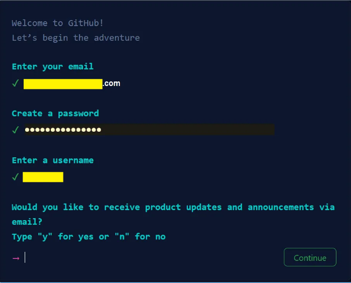
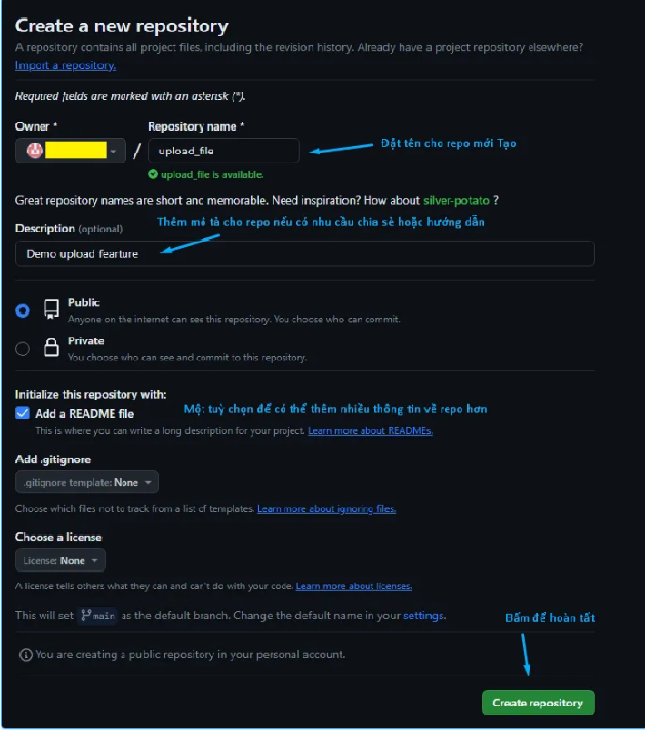
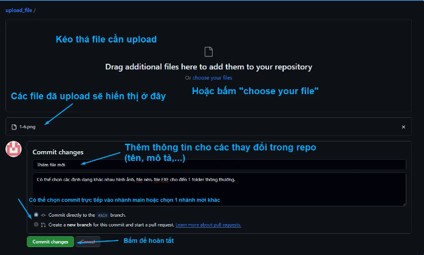
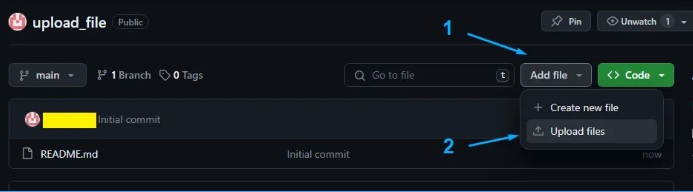
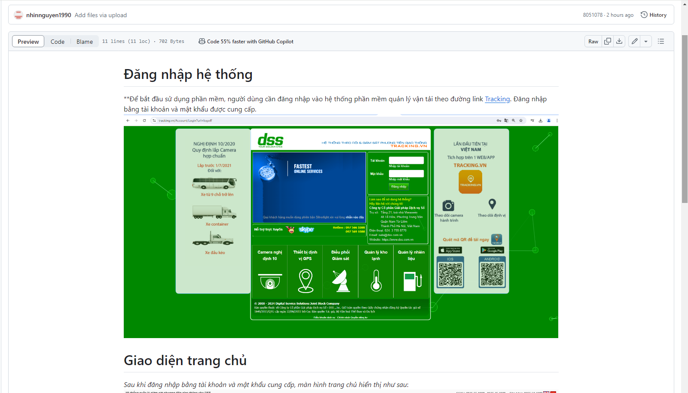

# 1. Cài đặt Visual Studio Code
# 2. Hướng dẫn tạo file .md
## 2.1. Tạo file .md trên Visual Studio code
* Chọn File -> new file
* Chọn thư mục -> nhập tên file.md. Ví dụ readme.md
## 2.2. Cách viết file.md
### Tiêu đề
Để tạo tiêu đề, bạn có thể sử dụng dấu thăng (#) và số lượng dấu thăng tương ứng với cấp độ của tiêu đề. Ví dụ: # Tiêu đề cấp 1, ## Tiêu đề cấp 2, ### Tiêu đề cấp 3.
### Định dạng văn bản
* Để bôi đậm một phần văn bản, bạn có thể sử dụng hai dấu sao (**) hoặc hai dấu gạch chân (__). Ví dụ: (**bôi đậm**).
* Để in nghiêng một phần văn bản, bạn có thể sử dụng một dấu sao (*) hoặc một dấu gạch chân (_). Ví dụ: (*in nghiêng*).
* Để tạo liên kết, bạn có thể sử dụng cú pháp [tên liên kết](đường dẫn).
* Để chèn hình ảnh, bạn có thể sử dụng cú pháp .
### Danh sách
* Để tạo danh sách không thứ tự, bạn có thể sử dụng dấu gạch ngang (-) hoặc dấu sao (*). 
* Để tạo danh sách có thứ tự, bạn có thể sử dụng số và dấu chấm (.)
# 3. Tạo tài khoản Github
* Đầu tiên, bạn truy cập vào trang chủ chính thức của [GitHub](https://github.com) và đăng nhập bằng cách click chọn Sign Up, sau đó điền lần lượt các thông tin cần thiết như User name, Email address, Password

* Tiếp theo, hãy tích chọn ô “Send me occasional product updates, announcement, and offers” nếu muốn nhận thông báo về thông tin cập nhật, ưu đãi… rồi chọn Verify > Create account để hoàn tất quá trình tạo tài khoản
# 4. Tải file lên hệ thống
* Hãy tạo 1 kho lưu trữ GitHub mới. Sau đó, bạn truy cập vào kho lưu trữ rồi chọn Add file (Thêm tệp), sau đó click vào Upload files (Tải tệp lên)

* Bước 2: Sau đó, bạn chỉ cần kéo và thả thư mục để tải lên kho lưu trữ một cách nhanh chóng nhất.hoặc click chọn Choose your files (Chọn file của bạn) để tải lên là hoàn tất

* Hoặc click chọn Choose your files (Chọn file của bạn) để tải lên là hoàn tất

* Giao diện

